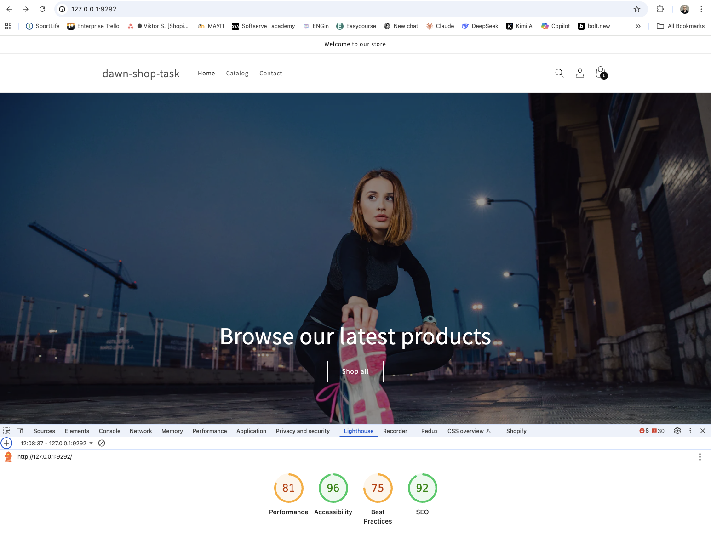
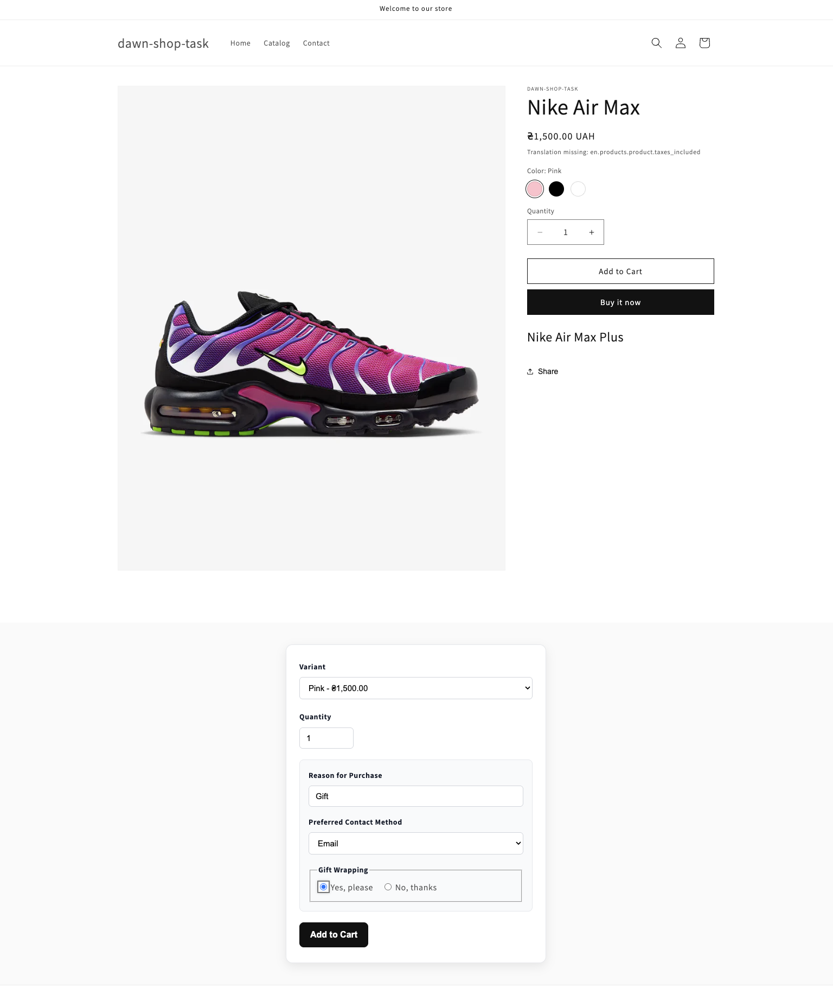

# Shopify Mini Theme

Мінімалістична Shopify тема з кастомними секціями для промо-банерів та обраних
товарів.

1. **Promo Banners** — секція для відображення промо-банерів з можливістю
   налаштування
2. **Featured Products** — секція для показу обраних товарів з колекції з
   клієнтським сортуванням

## Функціонал

### Promo Banners Section

- Налаштовуваний заголовок та підзаголовок
- Вибір вирівнювання тексту (left, center, right)
- Регулювання відступів секції (0-100px)
- 3 кольорові схеми (light, dark, accent) у пастельних тонах
- Блоки з зображеннями, заголовками та кнопками
- Вибір співвідношення сторін (16:9, 1:1, 3:2)

### Featured Products Section

- Вибір колекції товарів
- Регулювання кількості товарів (2-12)
- Опціональне відображення ціни та рейтингу
- Кнопка "View Product" для переходу на сторінку товару
- Клієнтське сортування:
  - Best Selling
  - Price: Low to High
  - Price: High to Low
  - Alphabetically, A–Z
- Відображення sale prices
- Placeholder для товарів без зображень
- Стан "Sold out"

