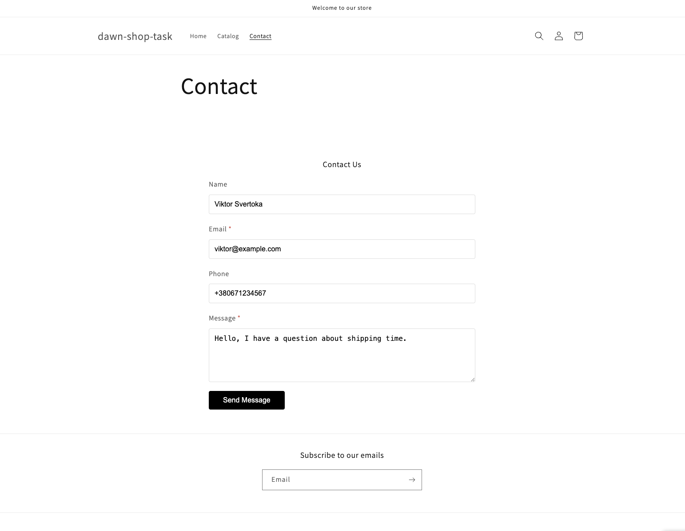
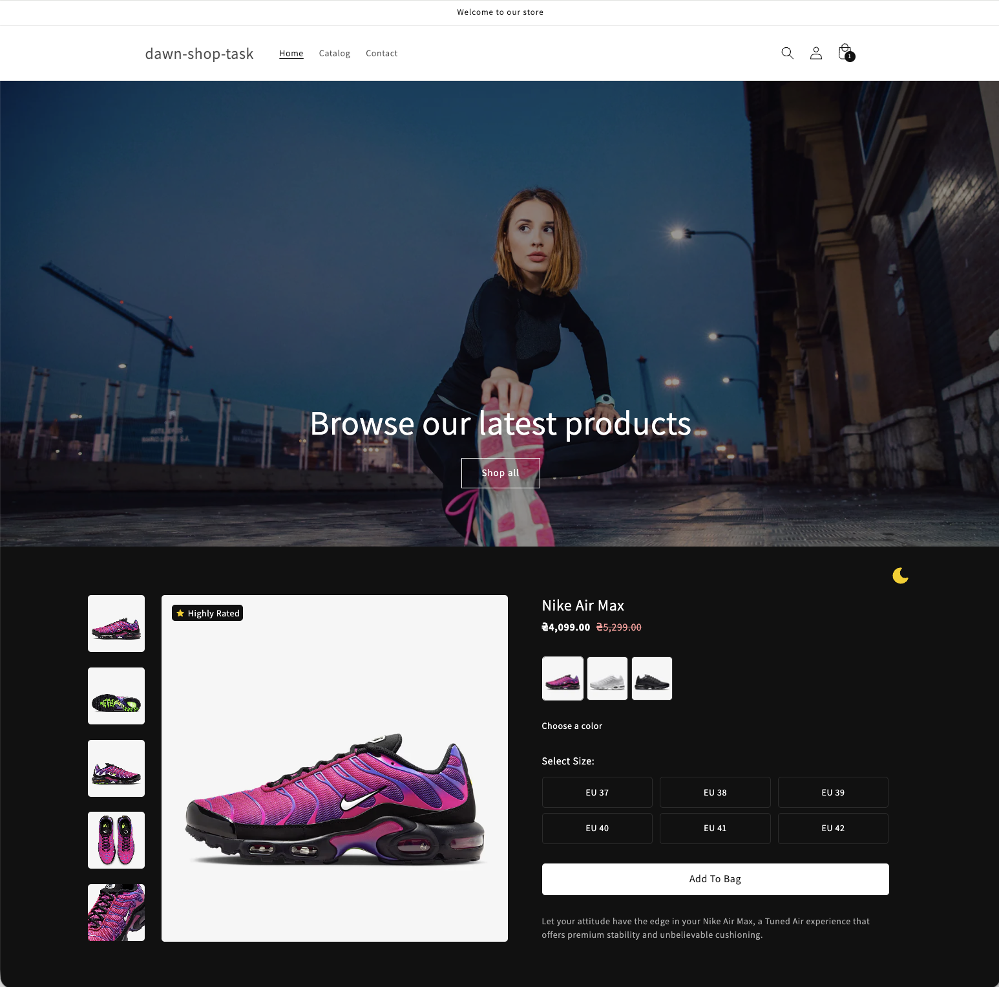

# [ДЗ] Shopify: Accessibility (A11y) у Shopify темах

Короткий звіт про тестування доступності та виправлення, виконані в рамках
завдання.

## Використані інструменти

- **W3C Validator** — перевірка HTML
- **Lighthouse (Chrome DevTools → Accessibility)**
- **Keyboard Tabbing (TAB, Shift+TAB)**
- **VoiceOver (macOS)**

## Знайдені проблеми

Під час ручного тестування були виявлені **2 основні проблеми доступності**.
Автоматичні валідатори не виявили помилок у файлах теми (попередження генерує
сам Shopify).

### 1. Превʼю-зображення товару не виділялись через TAB

**Проблема:** елементи були обгорнуті в `<div>`, який не фокусується.

**Було:**

```html
<div class="rounded-lg ...">
  
</div>
```

**Стало:**

```html
<button
  type="button"
  class="rounded-lg js-thumb-btn"
  aria-label="Show image..."
>
  
</button>
```

**Результат:**

- TAB виділяє кожне превʼю
- Правильна семантика
- Підтримка VoiceOver

### 2. Кнопка у Promo Banners була реалізована через `<span>`

**Проблема:** `<span>` не є інтерактивним елементом і не отримує фокус.

**Було:**

```liquid
<span class='promo-banners__btn'>
  {{- block.settings.button_text -}}
</span>
```

**Стало:**

```liquid
<a href='{{ block.settings.button_link }}' class='promo-banners__btn'>
  {{ block.settings.button_text }}
</a>
```

**Результат:**

- Кнопка стає доступною для TAB
- Натискання Enter працює коректно
- Семантика відповідає WCAG

## Підсумок

- **Lighthouse Accessibility = 100**
- Усі інтерактивні елементи доступні через клавіатуру
- Попередження W3C стосуються Shopify і не містяться у файлах теми
- Виправлено 2 реальні порушення доступності

## Результат роботи

- Проведено аудит доступності теми
- Протестовано через W3C, Lighthouse, VoiceOver і TAB-навігацію
- Виправлено знайдені проблеми




