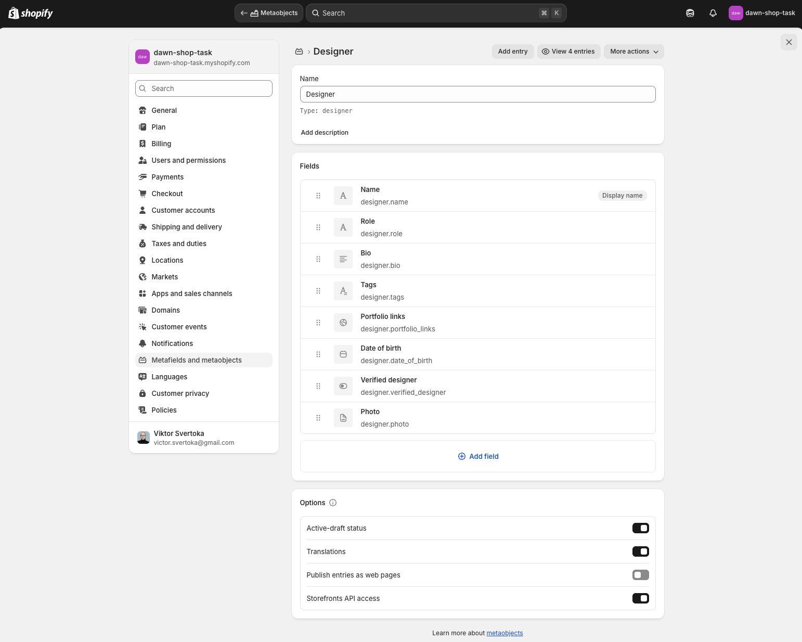

# [ДЗ] Shopify: Інтеграція Tailwind CSS v4 та рефактор секції Banner Product

## Опис завдання

Домашнє завдання передбачало:

- Інтегрувати **Tailwind CSS v4** у тему **Dawn**
- Переконатися, що стилі Tailwind коректно компілюються та застосовуються до
  елементів теми
- Виконати рефактор секції **`banner-product`** із використанням **лише
  утилітарних класів Tailwind**, без кастомного CSS
- Додатково реалізовано **Dark Mode** для секції

## Реалізований функціонал

- [x] Повна Tailwind інтеграція (v4 утиліти замість звичайного CSS)
- [x] Рефактор секції `banner-product` — усі стилі винесено в утилітарні класи
- [x] Кастомні CSS-змінні через `@theme` для розмірів, кольорів і типографії
- [x] Dark mode-перемикач для секції, що працює локально через `localStorage`
- [x] Модульна структура: `banner-product.js`, `banner-toggle.js`

## Технології та інструменти

- **Shopify Liquid** (Sections, Snippets, Assets, Dynamic data)
- **Tailwind CSS v4** з підтримкою `@theme`, `@layer`, `@utility`
- **Vanilla JS** для галереї та theme-toggle

