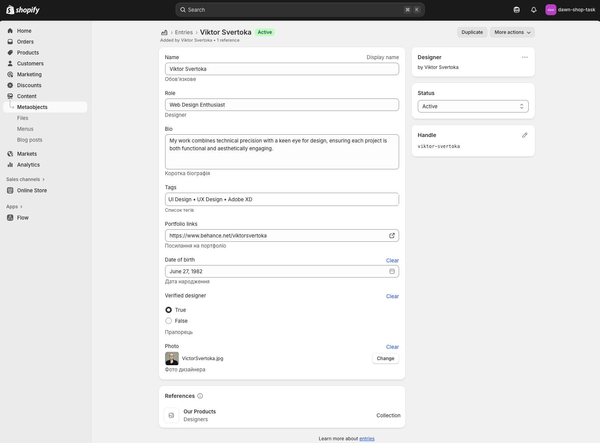
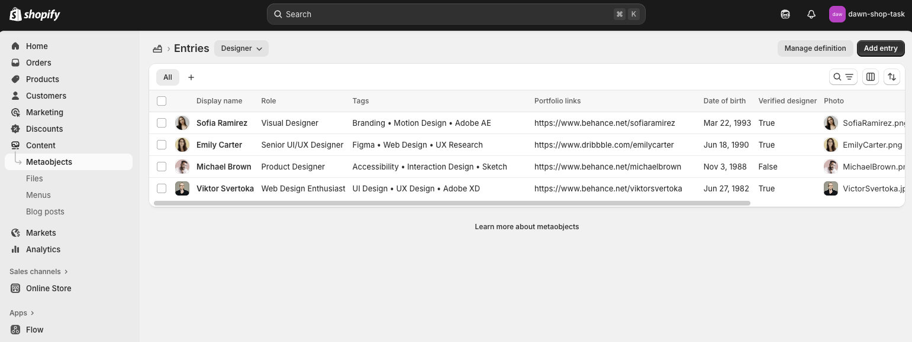

# Shopify Mini Theme — Designer Cards Section

Мінімалістичне розширення теми для виведення дизайнерів за допомогою
**metaobject** та **metafield**.  
Секція динамічно показує картки дизайнерів із фото, біографією, тегами,
портфоліо та статусом перевірки.

## Функціонал

### Designer Metaobject

Створено окремий тип **Designer**, який зберігає дані про кожного дизайнера:
ім’я, роль, біографію, навички, посилання на портфоліо, дату народження, статус
перевірки та фото.  
Метаоб’єкт дозволяє легко оновлювати або додавати нових дизайнерів без
редагування коду.

### Collection Metafield

Для колекцій додано метаполе, що дозволяє прив’язати кілька дизайнерів до
конкретної колекції.  
Завдяки цьому секція автоматично відображає лише тих дизайнерів, які належать до
вибраної колекції.

### Designer Cards Section

Секція **Designer Cards** відображає дизайнерів у вигляді адаптивної сітки.  
Для кожного дизайнера показуються:

- Фото та роль
- Біографія
- Список тегів
- Посилання на портфоліо
- Дата народження
- Статус “Verified Designer” або “Not verified”

### Візуальне оформлення

- Акуратний мінімалістичний дизайн у стилі Shopify
- Адаптивна сітка карток (CSS Grid)
- Винесені змінні кольорів у `:root`
- Ефекти наведення та тіні для карток
- Візуальне розділення перевірених і неперевірених дизайнерів

### Технології

- **Shopify Metaobjects & Metafields**
- **Liquid Templates**
- **CSS Grid + змінні кольорів**
- **Shopify Theme Editor** для динамічного керування даними

### Результат

✅ Динамічне підключення дизайнерів через адмінку  
✅ Гнучке відображення контенту без редагування коду  
✅ Стильна секція, яку можна перевикористовувати в інших частинах теми
