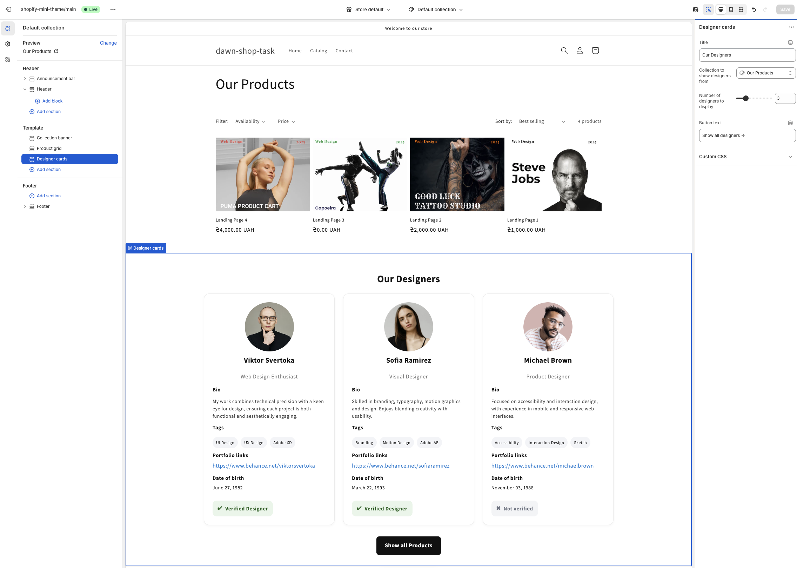

# [ДЗ] Shopify: Реалізовано Contact Form та Product Inquiry Form

## Опис завдання

Реалізовано дві форми відповідно до домашнього завдання з теми **«Робота з
формами в Shopify»**:

- **Contact Form** — форма зворотного зв’язку
- **Product Inquiry Form** — форма запиту про товар / додавання до кошика

## Реалізований функціонал

- [x] Створено секцію **`contact-form.liquid`**
- [x] Створено секцію **`product-inquiry-form.liquid`**
- [x] Додано файли стилів **`contact-form.css`** та
      **`product-inquiry-form.css`**
- [x] Реалізовано **повідомлення успіху / помилок** через
      `form.posted_successfully?` і `form.errors`
- [x] Впроваджено **honeypot-антиспам-поле**
- [x] Додано **ARIA-атрибути**: `aria-live`, `aria-describedby`, `aria-invalid`,
      `aria-busy`
- [x] Кнопка сабміту блокується під час відправлення
- [x] Повідомлення про статус у ролях `role="status"` і `role="alert"`
- [x] Валідація кількості (`min="1"`) для продукту
- [x] Обробка стану **недоступного варіанту** (`disabled`, aria-live)
- [x] Передача **custom properties** у line item:
  - `properties[Reason]`
  - `properties[Preferred contact]`
  - `properties[Gift wrap]`
- [x] Повна **локалізація** (через `| t`) у файлах `en.default.json` та
      `uk.json`

## Технології та підходи

- Shopify Liquid (Sections, Snippets, Localization)
- HTML5 + CSS3 (модульна структура, BEM-like класи)
- a11y / ARIA best practices
- Git + GitHub (feature branching workflow)

## Contact Form - функціональність

- Поля: Name, Email (required), Phone, Message (required)
- Honeypot-антиспам
- Повідомлення про успіх/помилки з підтримкою ARIA
- Валідація email та message
- Тексти через переклади (`| t`)
- Динамічна зміна стану кнопки при сабміті

## Product Inquiry Form - функціональність

- На базі `` із правильним `variant.id`
- Валідація `quantity` (`min="1"`)
- Обробка недоступних варіантів (`disabled`)
- Кастомні властивості (`properties[...]`):
  - **Reason**, **Preferred Contact**, **Gift wrap (yes/no)**
- Повідомлення про успіх і помилки
- ARIA-live оновлення тексту кнопки
- Локалізація всіх текстів

## Перевірка функціональності

- Надсилання контактної форми - показує повідомлення успіху
- Product Inquiry - додає товар до кошика з властивостями
- Варіант недоступний - кнопка “Add to Cart” заблокована
